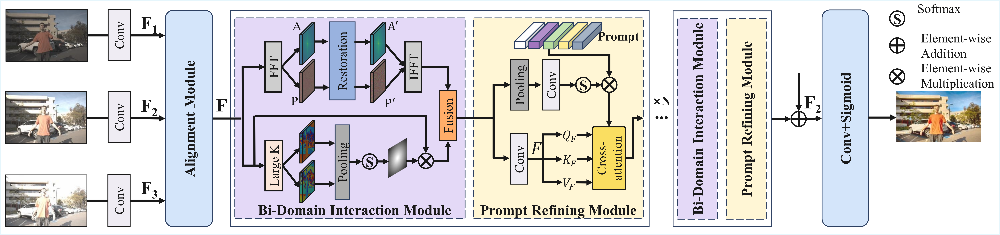

# TPGDiff: Hierarchical Triple-Prior Guided Diffusion for Image Restoration

---

> [Yanjie Tu](https://github.com/leoyjTu)<sup>1</sup>, [Qingsen Yan](https://scholar.google.com/citations?hl=zh-CN&user=BSGy3foAAAAJ&view_op=list_works&sortby=pubdate)<sup>12*</sup>, [Axi Niu](https://scholar.google.com/citations?user=5apnc_UAAAAJ&hl=en&oi=ao)<sup>1</sup>, Jiacong Tang<sup>1</sup><br>
> <sup>1</sup>Northwestern Polytechnical University <sup>2</sup>Shenzhen Research Institute of Northwestern Polytechnical University <sup>*</sup>Corresponding Author

<p align="center">
  <a href="https://leoyjtu.github.io/tpgdiff-project/">🌐Project Page</a> |
  <a href="https://arxiv.org/abs/2601.20306">📜Arxiv</a> 
</p>


## 🔥 Update Log
- [2026/01/28] 📢 📢 This repo is released.


## 📖 Method Overview
Overall architecture of TPGDiff. The framework explicitly models three types of priors from a low-quality input image and integrates them into a diffusion-based restoration network: (a) a semantic extractor that learns semantic representations via teacher–student distillation, (b) a degradation extractor that captures degradation-related characteristics, and (c) a structural adapter that injects structural priors into the diffusion model through a adapter module.

<p align="center">
  
</p>

---

## 🛠️ Prerequisites

- Python 3.8  
- Conda (recommended) or compatible virtual environment manager  
- Bash (for some provided shell scripts). On Windows, use WSL or adapt commands for PowerShell  

---

## 🌍 Create Environment

Create and activate the Conda environment named `tpgd` with Python 3.8:

```bash
conda create -n tpgd python=3.8 -y
conda activate tpgd
```

Install Python dependencies from `requirements.txt`:

```bash
pip install -r requirements.txt
```

## ⬇️ Dataset Preparation

Prepare the train and test datasets following the **Datasets** section in our paper.

Place training data under `datasets/train/` with the following structure (each degradation has paired `LQ/` and `GT/`):

```text
datasets/train/
├── low-light/
│   ├── LQ/   (*.png)
│   └── GT/   (*.png)
├── rainy/
├── noisy/
├── hazy/
└── blurry/
```


## 🚀 Getting Started

### Generate data 🗄️

Generate the dataset text files used by the first-stage training loader. From the project root:

```bash
cd scripts
python generate_data.py
```

The script produces `.txt` lists or dataset artifacts in the configured output folder. Inspect `scripts/generate_data.py` to point outputs to your dataset locations or to change split ratios.

### Training 🤯

Run the first-stage training. From the project root:

```bash
cd tpgd/src
bash single_train.sh
```

`single_train.sh` should call the appropriate Python training entrypoint with relevant config. Edit script or configuration files to change hyperparameters or dataset paths.


Run the second-stage restoration training using PyTorch distributed launch (example uses 2 GPUs):

```bash
cd universal-restoration/config/tpgd-sde/options
python -m torch.distributed.launch --nproc_per_node=2 --master_port=4321 train.py -opt=options/train.yml --launcher pytorch
```

Notes:
- Adjust `--nproc_per_node` to match the number of GPUs available.
- Change `--master_port` if the chosen port is in use.
- `-opt=options/train.yml` points to the YAML config for training; edit it to set dataset paths, model checkpoints, and training hyperparameters.
- Newer PyTorch versions recommend `torchrun` as an alternative to `torch.distributed.launch`.

### Testing 📜

After training, run test with the test configuration:

```bash
python test.py -opt=options/test.yml
```


## ✨ Qualitative Results

<details>
<summary><strong>Click to view qualitative comparison results</strong></summary>
<br>
<p align="center">
  
</p>
</details>


## ✨ Quantitative Results

<details>
<summary><strong>Single-task restoration</strong></summary>
<br>
<p align="center">
  
</p>
</details>
<details>
<summary><strong>Multi-degradation (5D) restoration</strong></summary>
<br>
<p align="center">
  
</p>
</details>
<details>
<summary><strong>Unknown degradation setting</strong></summary>
<br>
<p align="center">
  
</p>
</details>

## 📏 Troubleshooting

- CUDA / PyTorch mismatch: Verify installed `torch` wheel matches your CUDA toolkit version. Reinstall `torch` if necessary.
- Distributed errors: Ensure network ports are free and environment variables (`MASTER_ADDR`, `MASTER_PORT`) are set correctly if using multi-node setups.
- Missing dependencies: Inspect top-level and component `requirements` or `setup` files and install any additional packages required by specific modules.
- Windows users: Some shell scripts use `bash`; run them under WSL or convert commands for PowerShell.


## 💖 Acknowledgment

This project is based on [DA-CLIP](https://github.com/Algolzw/daclip-uir), [IR-SDE](https://github.com/Algolzw/image-restoration-sde), and [open_clip](https://github.com/mlfoundations/open_clip). Thanks for their awesome works.


## 🤝🏼 Citation

If this code contributes to your research, please cite our work:

```bibtex
@article{tu2026tpgdiff,
  title={TPGDiff: Hierarchical Triple-Prior Guided Diffusion for Image Restoration},
  author={Tu, Yanjie and Yan, Qingsen and Niu, Axi and Tang, Jiacong},
  journal={arXiv preprint arXiv:2601.20306},
  year={2026}
}
```

## 🔆 contact
If you have any questions, please feel free to contact with me at yanjietu@mail.nwpu.edu.cn
